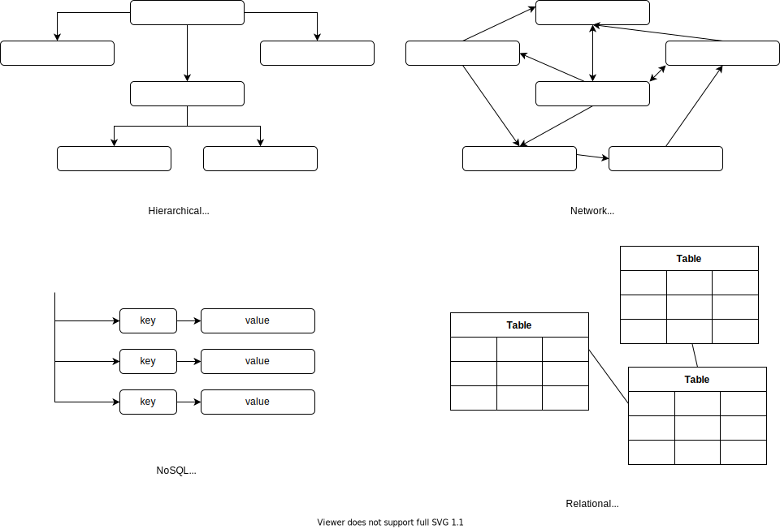
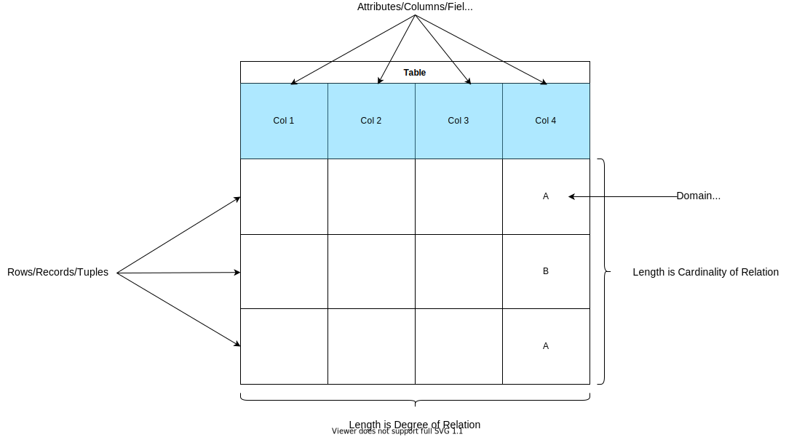
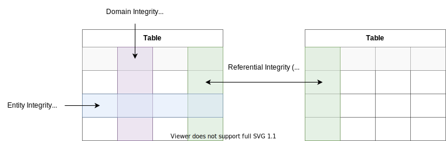

<link rel="stylesheet" type="text/css" href="./assets/timeline.css">
<link rel="stylesheet" type="text/css" href="./assets/white-bg.css">

# Introduction

- [Introduction](#introduction)
  - [Database Systems Overview](#database-systems-overview)
    - [Data Analysis](#data-analysis)
    - [Data Requirements](#data-requirements)
    - [Flat Files](#flat-files)
    - [Flat Files: Pros and Cons](#flat-files-pros-and-cons)
    - [Database Systems](#database-systems)
    - [Functions of DBMS](#functions-of-dbms)
  - [The Database Model](#the-database-model)
  - [Types of Database Systems](#types-of-database-systems)
- [Relational Databases](#relational-databases)
  - [Data Integrity and Constraints](#data-integrity-and-constraints)
   [Data Requirements](#data-requirements)
    - [Flat Files](#flat-files)
    - [Flat Files: Pros and Cons](#flat-files-pros-and-cons)
    - [Database Systems](#database-systems)
  - [Types of Database Systems](#types-of-database-systems)
  - [Relational Model](#relational-model)
  - [Data Integrity and Constraints](#data-integrity-and-constraints)

## Database Systems Overview

### Data Analysis

- _**Data**_: Unprocessed Inputs
- _**Information**_: Processing of Data
- _**Knowledge**_: Union/Synthesization of Data and Information to inform decision
  making

### Data Requirements

Software Applications the utilize data behave like **CAASI**:

- **C**_oncurrency_: same time accessibility
- **A**_vailability_: all time accessibility
- **A**_pplication Independence_: device agnostic
- **S**_ecurity_: accessible to only authorized parties
- **I**_ntegrity_: valid and accurate

### Flat Files

Are records of uniform format, with no structures for indexing or recognizing
relationships between records.

**Examples**:

- text files
- csv files
- png files

### Flat Files: Pros and Cons

**Pros**:

- Simplicity
- Ease of accessibility

**Cons**:

- Program depends on physical structure of data
- Complex process to fetch data
- Loss of data on simultaneous access
- Inability to give access based on record (Security)
- Data redundancy

### Database Systems

* **Database**: Shared collection of logically related data with description.

* **Database Management System (DBMS)**: Software system that enables users to
define, create, maintain, and control access to the database.

* **Application Program**: Communicates with database via appropriate request
(i.e. SQL).

* **Client-Server Architecture**: computing model where the server hosts, delivers
and manages most of the resources and services to be consumed by the client.

### Functions of DBMS

- _Concurrency Control_: Simultaneous data access
- _Recovery_           : Ensure data loss is minimal
- _Security_           : Authorised user access only
- _Utilities_          : Import/export, user management, backup, performance, analysis, loggin and audits
- _Transaction Support_: Ensure modifications to db successful or not done at
  all i.e. atomic
- _Data Management_    : **S**tore, **R**etrieve, **Modify** data

## The Database Model

A data model provides a standardized abstract model of data element and object
(i.e. class instances) relationships . In regards to database systems we call
the model which determines the logical structure of our system as its database
model.

## Types of Database Systems

Database systems (i.e. the database model) are named based upon their underlying
structure. The following timeline shows the chronological order of their
evolution.

  

    

      
Hierarchical

    

  

  

    

      
Network

    

  

  

    

      
Relational

    

  

  

    

      
NoSql

    

  

The following graphic shows an overview of the types of database system.

  </img>

# Relational Databases

A relational database stores and provides an access point to related data. This
is commonly performed by storing data within rows and columns in tables. The
strength of a relational databases is that retrieving data involving
multiple relations is extremely efficient.

For a our relational database we have the following definitions:

_**Relational Model**_: A collection of relations with distinct relation names

_**Relations/Columns/Fields**_: Tables where data is stored in a relational database

_**Attributes/Columns/Fields**_: Named column of a relation

_**Rows/Records/Tuples**_: Row in a relation

_**Cardinality**_: Number of rows contained within a relation

_**Degree**_: Number of attributes contained in a relation

_**Domain**_: Set of allowable values within an attribute

  </img>

## Data Integrity and Constraints

_**Data Integrity**_: Maintenance and assurance of data accuracy and consistency
over its entire life cycle. In a Database System this is done via constraints.

_**Candidate Key**_: Minimal set of attributes which uniquely identify a tuple
within a relation.

_**Primary Key**_: Is the candidate key chosen to uniquely identify a row within a
relation.

_**Foreign Key**_: Set of columns in a child table which match the attributes of
the corresponding parent table. MUST refer to either primary or unique keys
within a parent table.

Three types of integrity constraints:

<table>
  <tr>
    <th>Integrity Types</th>
    <th>Definition</th>
    <th>Enforced Via </th>
  </tr>
  <tr>
    <td>Entity Integrity</td>
    <td>Each <b>Record</b> within the table must have an uniquely identified <b>Attribute</></td>
    <td>Primary Key</td>
  </tr>
  <tr>
    <td>Domain Integrity</td>
    <td>All <b>Attributes</b> within a <b>Relation</b> require a defined <b>Domain</b></td>
    <td>Data types, check constraints</td>
  </tr>
  <tr>
    <td>Referential Integrity</td>
    <td>For related tables there will exist matching <b>Attribute</b></td>
    <td>Foreign keys</td>
  </tr>
</table>

  </img>

