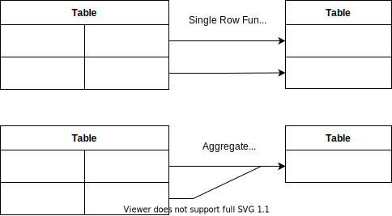
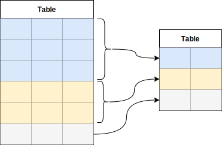

<link rel="stylesheet" type="text/css" href="./assets/order-of-operations">
<link rel="stylesheet" type="text/css" href="./assets/white-bg.css">

# Basic Database Manipulation Language Statements

- [Basic Database Manipulation Language Statements](#basic-database-manipulation-language-statements)
  - [Insert Statement](#insert-statement)
  - [Update Statement](#update-statement)
  - [Delete Statement](#delete-statement)
  - [Truncate Satement](#truncate-satement)
  - [Select Statement](#select-statement)
    - [Between Operator](#between-operator)
    - [Like Operator](#like-operator)
  - [SQL Functions](#sql-functions)
    - [Converting Timestamp to local time](#converting-timestamp-to-local-time)
    - [Type Casting](#type-casting)
  - [Order of Clause Execution](#order-of-clause-execution)
  - [Common Clauses](#common-clauses)
    - [Where](#where)
    - [Order By](#order-by)
    - [Limit/Offset](#limitoffset)
    - [Group By Clause](#group-by-clause)
    - [Having Clause](#having-clause)
    - [Join](#join)
      - [Joins with Condition Syntax](#joins-with-condition-syntax)

## Insert Statement

Adds records to the table:

```sql
-- insert row into table. Length of values =  Degree
INSERT INTO
  tableName
VALUES
  (v1, v2, ...);
-- if we only want to put values into specific attributes
INSERT INTO
  tableName(colName1, colName2,...)
VALUES
  (v1, v2, ...);
-- if we want to insert values from another table into specific attributes
INSERT INTO
  tableName(colName1, colName2,...)
VALUES
  SELECT
    (c1, c2,...)
  FROM
    tableName2;
```

## Update Statement

Modifies existing columns. Updates record within column.

```sql
-- set the values of a single column
UPDATE
  tableName
SET
  colName1 = someValues;
-- set the values of a single column given that the row matches a condition
UPDATE
  tableName
SET
  colName = someValues
WHERE
  conditon;
-- update the values of multiple columns given all rows match some condition
UPDATE
  tableName
SET
  colName1 = someValues, colName2 = someValues
WHERE
  conditon;
```

## Delete Statement

Remove rows from a table

```sql
-- will delete all records from a table
DELETE FROM
  tableName;

-- will delete rows which match the condition
DELETE FROM
  tableName;
WHERE
  conditon;
```

## Truncate Satement

Removes all rows from a table/partition of table. Does not log individual row
deletions also it is faster and uses fewer systems and transaction log resources
than `DELETE`

```sql
TRUNCATE TABLE tableName;
```

## Select Statement

Retrieve/fetch data from a database

```sql
-- retrieve all columns from table
SELECT
  *
FROM
  tableName;
-- retrieve specific columns from table
SELECT
  colName1, colName2
FROM
  tableName;
-- retrieve specific columns from table given some condition
SELECT
  colName1, colName2
FROM
  tableName
WHERE
  condition;
```

Select can have many clauses:

- `SELECT DISTINCT columnName FROM tableName`
- `SELECT columnName FROM tableName WHERE boolean`

### Between Operator

For `SELECT ID, ENAME FROM Employee WHERE SALARY BETWEEN 30000 and 50000`
includes both the boundary values

### Like Operator

Matches character patterns. Allows the use of wildcards:

- `%`: Matches any number of characters
- `_`: Matches exactly one characters

## SQL Functions

Are built-in modules used to manipulate data. All functions return single
values.

- _Single Row Function_: Operate row by row.

- _Aggregate Functions_: Operate on multiple rows to return a single row.
    - Some aggregate functions like `SUM (total)`, `AVG (average)` operate only on
      numeric columns
    - While others like `MIN (lowest value)`, `MAX (highest value)`
      and `COUNT (number of rows)` operate on all data types.
    - All aggregate functions ignore `NULL` values except `COUNT(*)`.

- _Miscellaneous Function_:
    - `NVL`: Substitutes value1 by value2 if value1 is NULL. The data type of
      value1 and value2 must be same.
    - `USER`: Returns the current logged in user

<div class="image">
</img>
</div>

### Converting Timestamp to local time

To convert a timestamp into the desired time zone we can use the
`AT TIME ZONE 'zone string'` function

```sql
SELECT NOW(), NOW() AT TIME ZONE 'UTC', NOW() AT TIME ZONE 'HST'
```

### Type Casting


## Order of Clause Execution

Given the many clauses of a select statement it is important to remember the
order of which they are executed, after the initial `SELECT` keyword.

```sql
FROM >> JOIN >> WHERE >> GROUP BY >> HAVING >> SELECT >> DISTINCT >> ORDER BY >> LIMIT/OFFSET
```

Information about clauses are provided in the following sections

## Common Clauses

### Where

Used to apply filter condition to rows of a statement

```sql
SELECT colName1, colName2,... FROM tableName WHERE condition
```

### Order By

Sorting data is performed using the `ORDER BY` method.

- Rows are sorted in ascending order if sort order is not specified
- ORDER BY clause must be the last clause and can be used only in SELECT
  statement
- If multiple rows have same value for columns in ORDER BY clause then they can
  appear in any order.


```sql
SELECT colName1, colName2, ... FROM tableName ORDER BY colName
SELECT colName1, colName2, ... FROM tableName ORDER BY colName1, colName2
SELECT colName1, colName2, ... FROM tableName ORDER BY colName DESC
SELECT colName1, colName2, ... FROM tableName ORDER BY colName ASC
SELECT colName1, colName2, ... FROM tableName ORDER BY colName1 ASC, colName2 DESC
SELECT colName1, colName2, ... FROM tableName ORDER BY 2,
```

### Limit/Offset

Limit request to only the first `n` number of rows.

```sql
SELECT colName1, colName2,... FROM tableName WHERE condition LIMIT n;
```

Or limit request to only the first `n` number of rows after skipping the first
`m` rows

```sql
SELECT colName1, colName2,... FROM tableName WHERE condition OFFSET m LIMIT n;
```


### Group By Clause

Groups data from table into different groups based off provided criteria before
applying aggregate functions.

<div class="image">
</img>
</div >


### Having Clause

Can be called **After** `group by` to apply condition to aggregate function,
similar to `where` clause

```sql
SELECT
    colName1, aggrFunc(colName2)
FROM
    tableName
WHERE
    condition
GROUP BY
    colName1
HAVING
    aggregateCondition
```

### Join

Types of joins

<div class="image">
  </img>
</div>

#### Joins with Condition Syntax

Examples `WHERE` condition

```sql
SELECT
  columns
FROM
  table1 t1
JOIN CLAUSE
  table2 t2 ON t1.col = t2.col
WHERE
  condition
```

Examples `AND` condition

```sql
SELECT
  columns
FROM
  table1 t1
JOIN CLAUSE
  table2 t2 ON t1.col = t2.col
AND
  condition
```

Note: `WHERE` ignores `NULL` entries and `AND` does not.